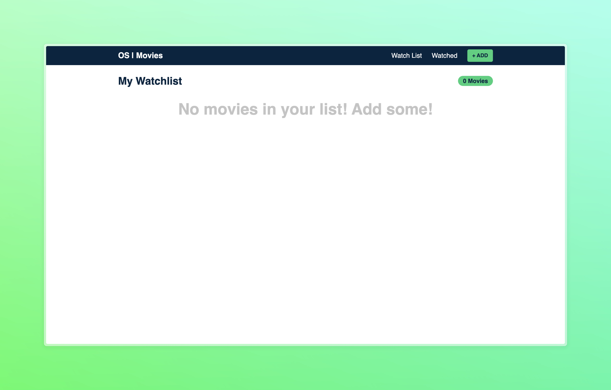
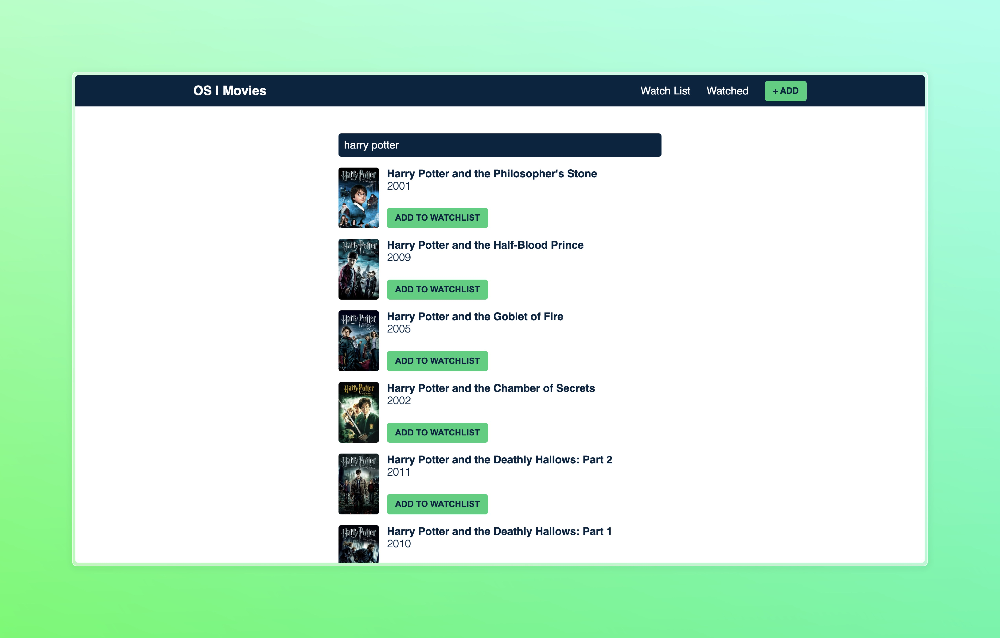
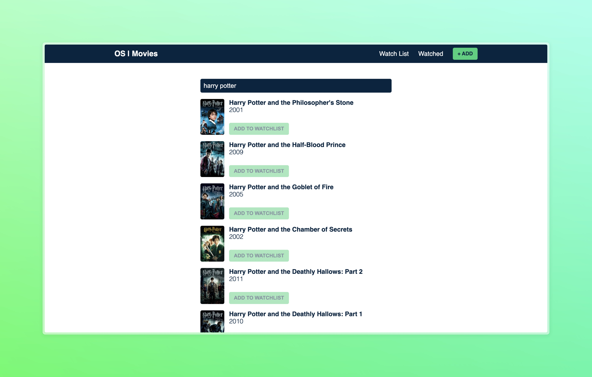
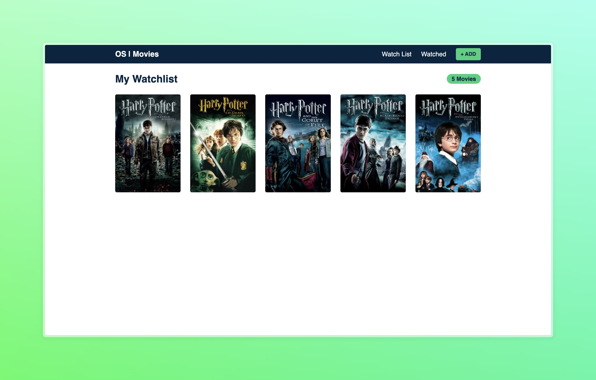
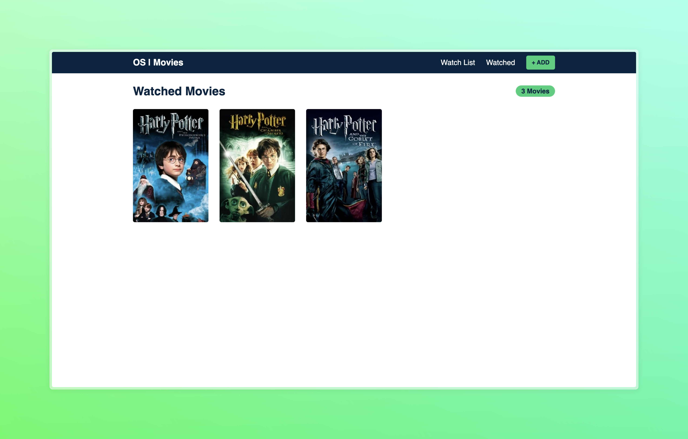

# Movie Watchlist with React Hooks, Context API, and LocalStorage**

This project is a simple Movie Watchlist application built using React Hooks, Context API for state management, and LocalStorage for persisting data. Users can add movies to their watchlist, mark them as watched, and remove them from the list.

### Screenshots

### Features

- **Add Movies:** Users can add movies to their watchlist by entering the movie title and clicking the "Add" button.
- **Mark as Watched:** Movies in the watchlist can be marked as watched by clicking the checkbox next to each movie.
- **Remove Movies:** Users can remove movies from the watchlist by clicking the "Remove" button next to each movie.
- **LocalStorage Persistence:** The watchlist data is stored in the browser's localStorage, so it persists even after the browser is closed.

### Technologies Used

- React: JavaScript library for building user interfaces.
- React Hooks: Functional components utilize hooks like useState and useContext for managing state.
- Context API: Provides a way to pass data through the component tree without having to pass props manually at every level.
- LocalStorage: Browser-based storage mechanism for persisting data.

### How to Run

1. Clone this repository to your local machine.
2. Navigate to the project directory in your terminal.
3. Run `npm install` to install the project dependencies.
4. Run `npm start` to start the development server.
5. Open your browser and navigate to `http://localhost:3000` to view the application.

### Contributors

- [Mahmoud Hussien](https://github.com/mahmudhmh)
